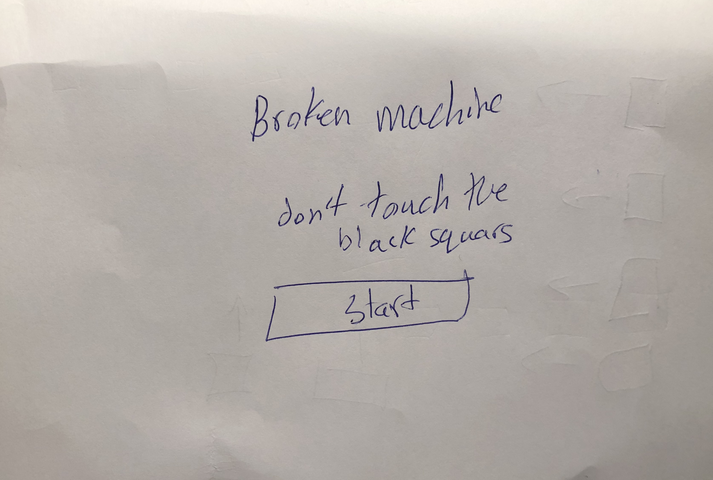
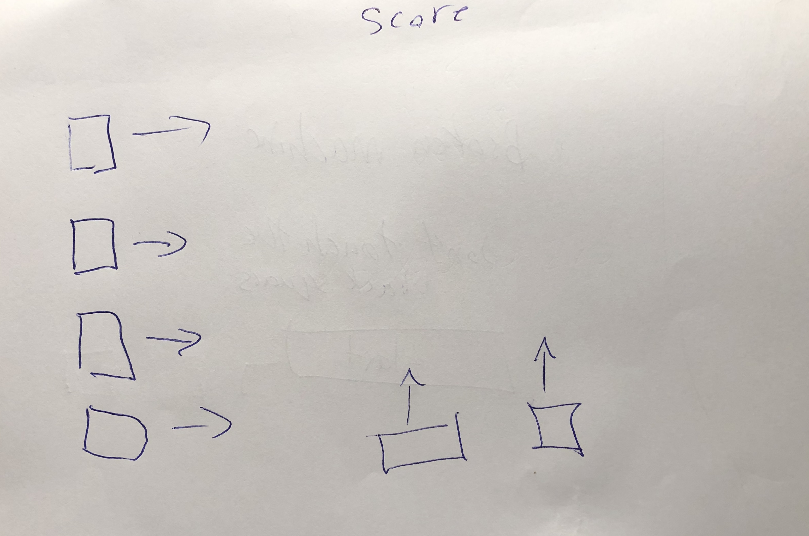
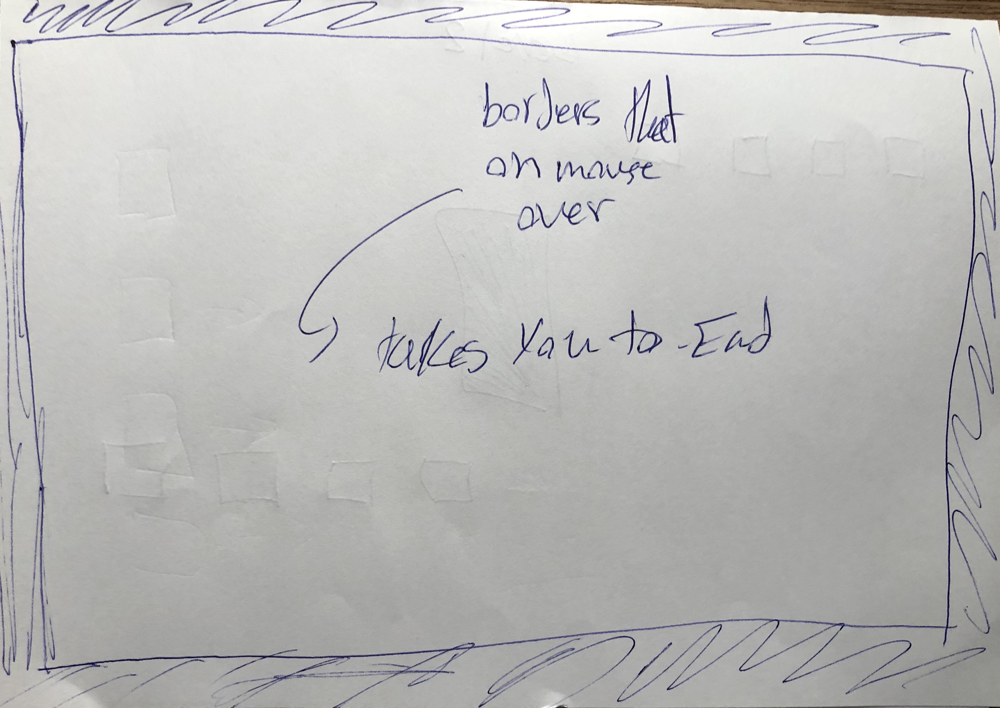
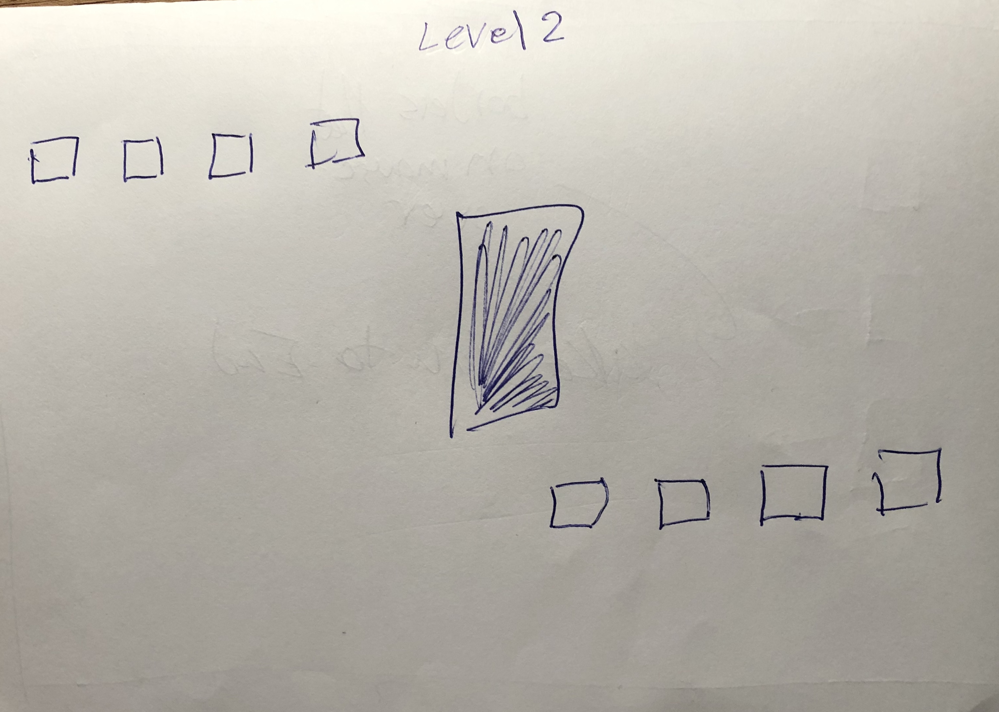

# Project Title

Broken Machine

## Description

A simple Game that could be played anywhere with simple UI and UX. 

### Technical Used
This game was made using pure Javascript to increase the game's effciency.

```
HTML
CSS
JavaScript
```

### Wireframes













### User Stories

- As a user I can play the game
- As a user I can have fun
- As a user I can challenge my friends


---

## Planning and Development Process

Day -1
- Created a simple animation usning javascript with editing the posstion from css.

- made the on mouse hover function 

Day 1
- Created a loop that can animate an object multiple times 

- Created a function that can animate more than one object

- Wrote a function that can randomise the direction in wich the object is going to

- Helped others with thier projects

Day 2
- Changed the game physics and made this game addictive 

- Created an outer border that doesn't allow users to cheat 

- Added a score feature 

- Fixed some bugs in the game 

- Made the intro page and switching to the game using Javascript


Day 3 
- Made another virsion of the game that is way hareder and has multipl levels

Day 4
- Comented the Javascript code 

- Made the presentation 

- writing this documentation 

### Problem-Solving Strategy

- Google it


- I made sure to look at the console when having errors and read the error.

- Take a break whenever I feel overwelming 

- console.log() //every step

- Comment and delet some code

- Ask for help 


### Unsolved problems

- I could not figure out how to make a score baord using fs that can work in the browser during the time limitation

- There was not time to make an AI enemies 

- I made two leverls but I could not make 5 diffrent levels because of the time constrains

- Fixing all gliches and ways that others can cheat inside the game because I don't have enough data

---

## Acknowledgments

* Don't give up easly take another look at what you have from another angle 

* People are awsome 

* Simplicity is amazing 

---

 ## References

- https://www.w3schools.com/jsref/met_node_appendchild.asp

- https://www.w3schools.com/jsref/event_onmouseover.asp

- https://www.w3schools.com/js/js_htmldom_animate.asp
